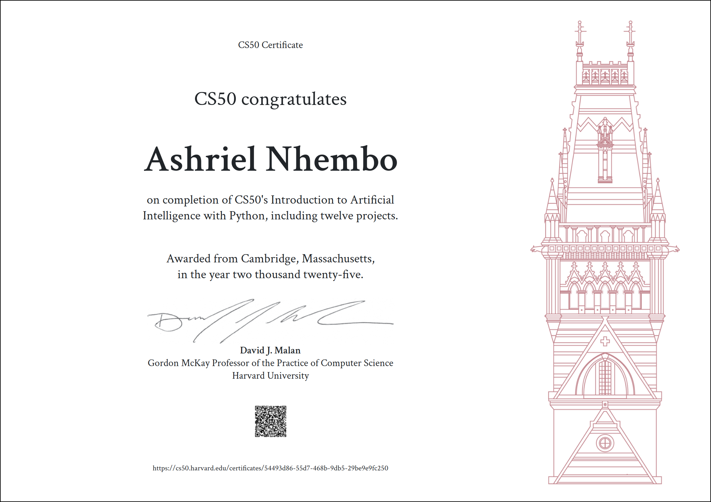

# CS50's Introduction to Artificial Intelligence with Python

This repository contains my solutions to the 12 projects from **CS50's Introduction to Artificial Intelligence with Python** course offered by Harvard University. These projects cover key topics in AI such as search algorithms, machine learning, natural language processing, and neural networks.

The code has passed all the test cases from submit50/check50, feel free to email me ashrielnhembo.dev@gmail.com if there is issue with the code.

## Certificate

I have completed the course and earned the certificate from Harvard. You can view the certificate above.

## Projects Overview

Here are the details of each project included in this repository:

### 1. Degrees of Separation
- **Description**: Find the shortest path between two actors using a breadth-first search algorithm.
- **Key Concepts**: Graph search, breadth-first search (BFS).

### 2. Tic-Tac-Toe
- **Description**: An implementation of a Tic-Tac-Toe AI using Minimax algorithm to make optimal moves.
- **Key Concepts**: Minimax, Game theory.

### 3. Minesweeper AI
- **Description**: AI that plays Minesweeper using logical deduction to find safe cells and mines.
- **Key Concepts**: Constraint satisfaction problems, logical inference.

### 4. Knights
- **Description**: Solve the problem of moving a knight on a chessboard using knowledge representation and search techniques.
- **Key Concepts**: Logic, knowledge representation.

### 5. Traffic
- **Description**: Implementation of Dijkstra's shortest path algorithm to find the optimal route in a city with traffic.
- **Key Concepts**: Shortest paths, Dijkstra's algorithm.

### 6. Parser
- **Description**: A natural language parser that extracts noun phrases from sentences.
- **Key Concepts**: Natural language processing, context-free grammars.

### 7. Shopping
- **Description**: Build a machine learning model that predicts whether customers will make a purchase based on their online activity.
- **Key Concepts**: Supervised learning, classification.

### 8. Nim
- **Description**: A reinforcement learning agent that plays the game of Nim and improves with each game.
- **Key Concepts**: Reinforcement learning, Q-learning.

### 9. Crosswords AI
- **Description**: Generate a crossword puzzle and create an AI that fills it in based on constraints.
- **Key Concepts**: Constraint satisfaction problems, backtracking.

### 10. Neural Networks
- **Description**: Build a neural network to recognize handwritten digits from the MNIST dataset.
- **Key Concepts**: Neural networks, deep learning.

### 11. Questions
- **Description**: An AI system that answers factual questions by finding relevant information in a given corpus of text.
- **Key Concepts**: Natural language processing, information retrieval.

### 12. Heredity
- **Description**: A Bayesian network model to predict genetic inheritance of traits.
- **Key Concepts**: Bayesian networks, probability theory.
=======

